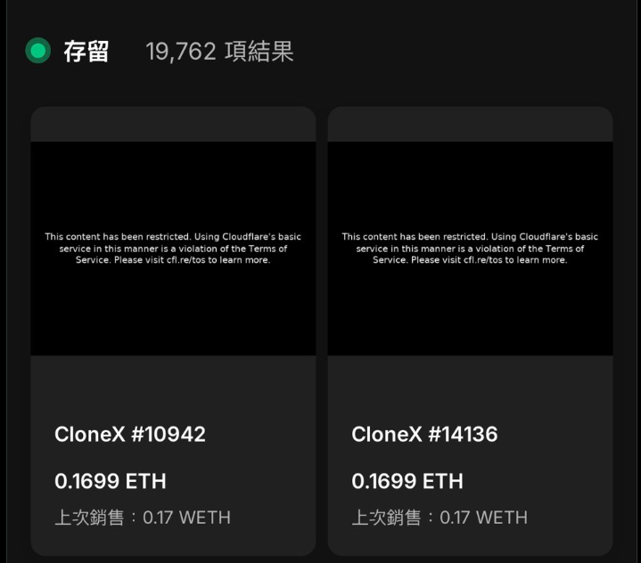
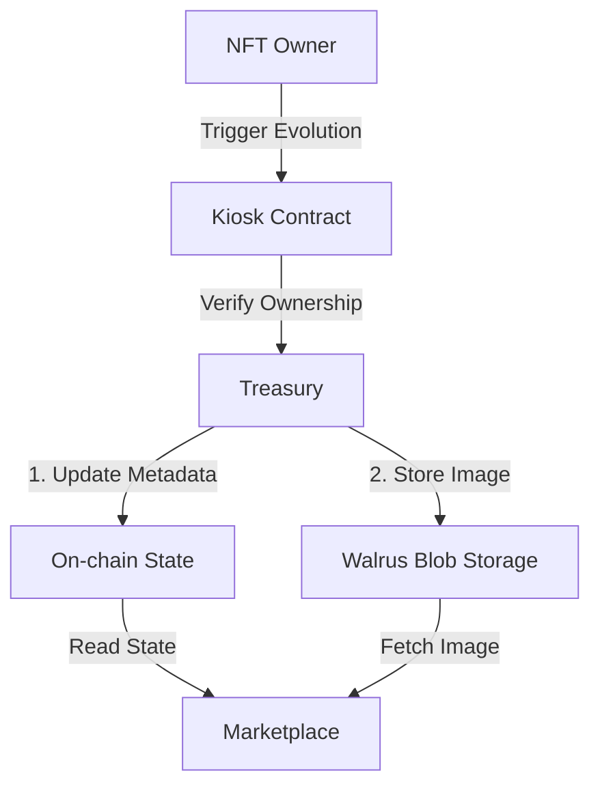
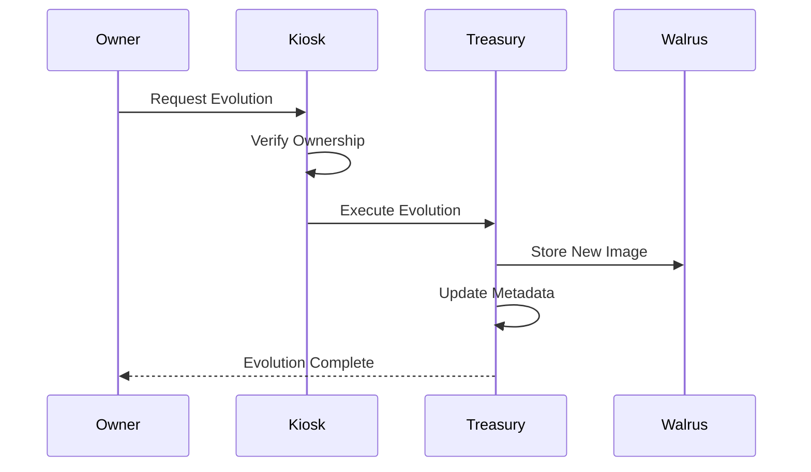
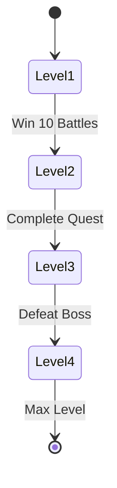
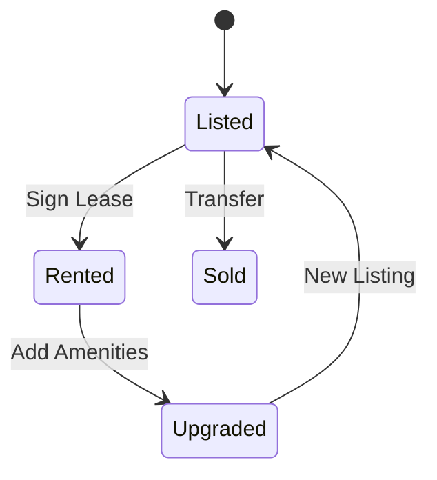

# The Axolotl Standard
## A Framework for Evolving NFTs on Sui Blockchain


> *"Like the regenerative axolotl salamander, these NFTs transform while maintaining their core identity."*

---

## Table of Contents

- [Introduction](#introduction)
- [Technical Implementation](#technical-implementation)
  - [State Management](#state-management)
  - [Evolution Mechanisms](#evolution-mechanisms)
  - [Storage Architecture](#storage-architecture)
- [Code Examples](#code-examples)
  - [Basic Implementation](#basic-implementation)
  - [Reveal Function](#reveal-function)
  - [Attribute Updates](#attribute-updates)
  - [Marketplace Integration](#marketplace-integration)
- [Real-World Applications](#real-world-applications)
  - [1. Gaming: Character Evolution](#1-gaming-character-evolution)
  - [2. Real World Assets (RWA): Property NFTs](#2-real-world-assets-rwa-property-nfts)
- [Why This is Revolutionary](#why-this-is-revolutionary)
- [VRAM Genesis Implementation](#vram-genesis-implementation)
- [Getting Started](#getting-started)
- [Documentation](#documentation)
- [License](#license)

---

## Introduction

The Axolotl Standard establishes a framework for NFTs that can transform and evolve over time while maintaining complete on-chain permanence. Built on Sui's object-centric model, this standard enables:

- ✨ Dynamic evolution of NFT imagery and metadata
- 🔄 Multiple evolution stages with different triggers
- 📜 Complete preservation of evolution history
- 🔗 Full compatibility with marketplace standards

---

## The Problem

<blockquote class="twitter-tweet">
<p lang="en" dir="ltr">CloneX like most of nft evolving are not true web3 assets. If the server die, so does the nft. @vramxai Genesis core NFT solve this issue thanks to axolotl protocols and utilize walrus to store and evolve assets.</p>&mdash; sid (@0x0sid) <a href="https://twitter.com/0x0sid/status/1915367044004126918">October 20, 2023</a>
</blockquote>

### Real-World Example: CloneX NFT Failure



*Above: CloneX NFTs #10942 and #14136 showing restricted content due to centralized server issues - Each NFT valued at 0.1699 ETH (~$450) is inaccessible*

This is a perfect example of centralization failure:
- 🚫 NFT images are inaccessible due to CDN/server restrictions
- 💸 Despite 0.1699 ETH value, holders can't view their assets
- ⚠️ Demonstrates complete dependence on centralized infrastructure
- 🔍 Shows why true decentralization is crucial for NFT longevity

The NFT space faces a critical centralization problem:
- ⚠️ Most "evolving NFTs" rely on centralized servers
- 💀 If the server dies, the NFT loses its data and value
- 🔒 Holders have no true ownership of their asset evolution
- 📊 Evolution history can be lost or manipulated

The Axolotl Standard solves these issues by providing:
- ✨ True decentralized evolution through Walrus blob storage
- 🔐 Permanent, immutable evolution history
- 🔄 Server-independent asset updates
- 🎮 Real Web3 ownership of evolving assets

---

## Technical Implementation

### State Management

The core of the Axolotl Standard is the Treasury structure that manages evolution states:

```rust
public struct Treasury has key {
    id: UID,
    // Track current image mapping for each address
    imgListOf: VecMap<address, String>,  
    // Track attribute keys for each address
    attrKeysListOf: VecMap<address, vector<String>>,  
    // Track attribute values for each address
    attrValuesListOf: VecMap<address, vector<String>>,  
    // Historical record of all images by ID
    imgHistoryOf: VecMap<u64, String>,
}
```

This structure maintains mappings between wallet addresses and their assets' current states, enabling controlled evolution of NFTs.

### Evolution Mechanisms

The standard supports multiple evolution patterns:

1. **Reveal-based Evolution**: Assets begin with a placeholder and evolve through reveals
2. **Attribute-based Evolution**: NFTs evolve through metadata updates
3. **Multi-stage Evolution**: Progressive changes through predefined stages
4. **Autonomous Evolution**: Self-evolving NFTs based on time or ecosystem events

### Storage Architecture

Axolotl NFTs utilize a hybrid storage approach:

- **On-chain data**: All metadata, ownership records, and evolution history
- **Decentralized blob storage**: Actual NFT image assets on Walrus
- **Hash verification**: Image integrity through on-chain verification

This architecture ensures efficiency, permanence, and censorship resistance.

---

## System Architecture



---

## Code Examples

### Basic Implementation

Here's how to create a basic Axolotl-compatible NFT:

```rust
/// Create a new Axolotl-standard NFT
public fun mint_nft(
    name: String,
    description: String,
    url: String,
    attributes: VecMap<String, String>,
    ctx: &mut TxContext
): NFT {
    let nft = NFT {
        id: object::new(ctx),
        name,
        description,
        url,
        attributes,
        evolution_stage: 0, // Initial stage
    };
    
    // Register with Treasury for evolution tracking
    register_nft(&nft, ctx);
    
    nft
}

/// Register the NFT with the Treasury
fun register_nft(nft: &NFT, ctx: &mut TxContext) {
    let treasury = get_treasury();
    let sender = tx_context::sender(ctx);
    
    // Set initial image in the Treasury
    vec_map::insert(&mut treasury.imgListOf, sender, nft.url);
    
    // Initialize attributes tracking
    let keys = vec_map::keys(&nft.attributes);
    let values = vec_map::values(&nft.attributes);
    vec_map::insert(&mut treasury.attrKeysListOf, sender, keys);
    vec_map::insert(&mut treasury.attrValuesListOf, sender, values);
}
```

### Reveal Function

Implement the reveal mechanism to evolve your NFT:

```rust
/// Update an NFT's image during reveal
public entry fun reveal_update_nft(
    name: String,
    description: String,
    ownerKiosk: &mut Kiosk,
    ownerKioskCap: &KioskOwnerCap,
    nftObjectId: ID,
    treasury: &mut Treasury,
    ctx: &mut TxContext
) {
    let account = tx_context::sender(ctx);
    
    // Check if there's an image update for this account
    if (vec_map::contains(&treasury.imgListOf, &account)) {
        // Apply the updated image hash
        let nft = kiosk::borrow_mut(ownerKiosk, ownerKioskCap, nftObjectId);
        nft.url = get_image_for_account(treasury, account);
        nft.evolution_stage += 1;
        
        // Record in history
        vec_map::insert(
            &mut treasury.imgHistoryOf, 
            object::id_to_inner(&nft.id), 
            nft.url
        );
    }
}

/// Helper to get the image for an account
fun get_image_for_account(treasury: &Treasury, account: address): String {
    *vec_map::get(&treasury.imgListOf, &account)
}
```

### Attribute Updates

Enable attribute-based evolution for your NFTs:

```rust
/// Update attributes during evolution
public entry fun update_attributes(
    ownerKiosk: &mut Kiosk,
    ownerKioskCap: &KioskOwnerCap,
    nftObjectId: ID,
    treasury: &mut Treasury,
    ctx: &mut TxContext
) {
    let account = tx_context::sender(ctx);
    
    // Check if there are attribute updates for this account
    if (vec_map::contains(&treasury.attrKeysListOf, &account) && 
        vec_map::contains(&treasury.attrValuesListOf, &account)) {
        
        // Get the new attributes for this account
        let keys = get_keys_for_account(treasury, account);
        let values = get_values_for_account(treasury, account);
        
        // Update the NFT's attributes
        let nft = kiosk::borrow_mut(ownerKiosk, ownerKioskCap, nftObjectId);
        nft.attributes = vec_map::from_keys_values(keys, values);
        nft.evolution_stage += 1;
    }
}

/// Helper to get attribute keys
fun get_keys_for_account(treasury: &Treasury, account: address): vector<String> {
    *vec_map::get(&treasury.attrKeysListOf, &account)
}

/// Helper to get attribute values
fun get_values_for_account(treasury: &Treasury, account: address): vector<String> {
    *vec_map::get(&treasury.attrValuesListOf, &account)
}
```

### Marketplace Integration

Integrate your evolving NFTs with Sui's Kiosk marketplace system:

```rust
/// Create kiosk and list an NFT
public entry fun list_on_marketplace(
    nft: NFT,
    price: u64,
    ctx: &mut TxContext
) {
    // Create a new kiosk
    let (kiosk, cap) = kiosk::new(ctx);
    
    // Create transfer policy with royalty
    let (policy, policyCap) = transfer_policy::new<NFT>(ctx);
    royalty_rule::add<NFT>(&mut policy, &policyCap, 500, 0); // 5% royalty
    
    // Place NFT in kiosk
    kiosk::place(&mut kiosk, &cap, nft);
    
    // List the NFT
    kiosk::list<NFT>(&mut kiosk, &cap, object::id(&nft), price);
    
    // Transfer ownership
    transfer::public_transfer(cap, tx_context::sender(ctx));
    transfer::public_share_object(kiosk);
    transfer::public_share_object(policy);
    transfer::public_transfer(policyCap, tx_context::sender(ctx));
}
```

---

## Evolution Flow



---

## Real-World Applications

### 1. Gaming: Character Evolution
The Axolotl Standard enables true on-chain character progression:
- 🎮 Characters can level up based on in-game achievements
- 🏆 Battle stats and equipment are stored on-chain
- 🔄 Visual evolution reflects character progression
- 🔐 All progress is verifiably stored using Walrus blob storage

Example Implementation:
```move
// Gaming character evolution
public entry fun level_up(
    treasury: &mut Treasury,
    character: &mut GameCharacter,
    ctx: &mut TxContext
) {
    // Verify owner through kiosk
    assert!(is_kiosk_owner(character, ctx), ERR_NOT_OWNER);
    
    // Update character stats
    character.level = character.level + 1;
    character.power = character.power * 1.2;
    
    // Update visual representation
    let new_image = get_evolution_image(character.level);
    update_nft_image(treasury, character.id, new_image, ctx);
}
```

### Gaming Evolution Example



### 2. Real World Assets (RWA): Property NFTs
Transform real estate ownership with evolving property NFTs:
- 🏠 Property value appreciation tracking
- 📈 Rental income history
- 🏗️ Improvements and renovations record
- ⚖️ Regulatory compliance updates

Example Implementation:
```move
// Property evolution with rental updates
public entry fun update_property_value(
    treasury: &mut Treasury,
    property: &mut PropertyNFT,
    new_rental_rate: u64,
    ctx: &mut TxContext
) {
    // Only kiosk owner can update
    assert!(is_kiosk_owner(property, ctx), ERR_NOT_OWNER);
    
    // Update rental rate
    property.rental_rate = new_rental_rate;
    property.last_update = tx_context::epoch(ctx);
    
    // Enforce fee for updates
    transfer::transfer(coin::create(FEE_AMOUNT, ctx), TREASURY_ADDRESS);
}
```

### RWA Property Evolution



---

## Why This is Revolutionary

1. **True Decentralization**
   - All evolution data stored on Walrus blob storage
   - No reliance on centralized servers
   - Complete history preservation
   - Verifiable evolution paths

2. **Composable Evolution**
   - NFTs can evolve based on multiple triggers
   - Cross-game/application compatibility
   - Programmable evolution paths
   - Community-driven evolution mechanics

3. **Secure Ownership**
   - Kiosk integration ensures only true owners can evolve NFTs
   - Transparent fee structure
   - Protected evolution rights
   - Marketplace compatibility

4. **Technical Innovation**
   - Efficient on-chain storage through Walrus
   - Gas-optimized evolution mechanics
   - Scalable attribute system
   - Cross-chain potential

---

## VRAM Genesis Implementation

The VRAM Genesis Collection (3,333 NFTs) showcases the Axolotl Standard's capabilities:
- 🎯 15 SUI mint price
- 🖼️ Decentralized storage on Walrus mainnet
- 🔄 Progressive utility evolution
- 🎁 Holder benefits (airdrops, AI access, governance)
- 🔗 Full marketplace integration

---

## Getting Started

1. Clone this repository
2. Install Sui CLI
3. Build the project:
```bash
sui move build
```

4. Deploy:
```bash
sui client publish --gas-budget 200000000
```

---

## Documentation

For full technical documentation, visit our [Gitbook](https://vram-ai-1.gitbook.io/).

---

## License

MIT License

---

*Built with ❤️ by VRAM AI*
